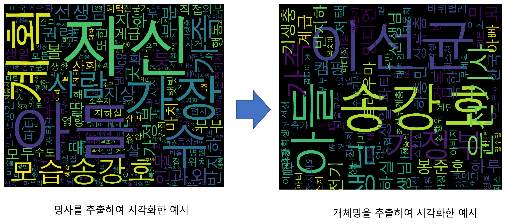
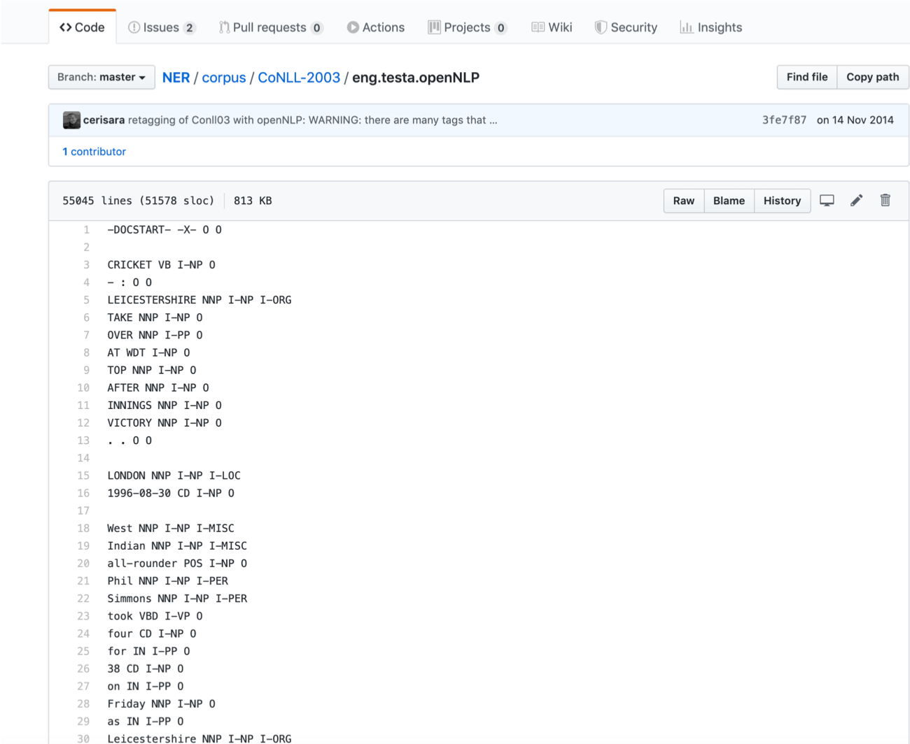
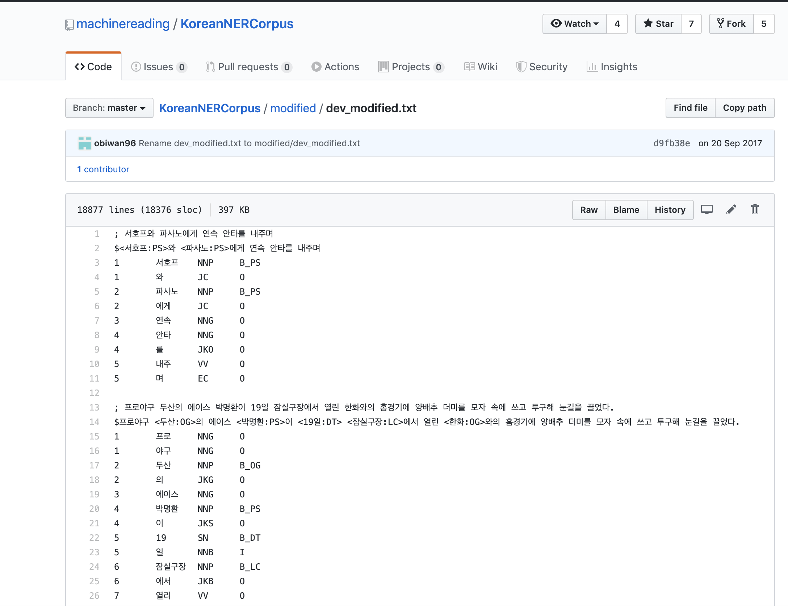
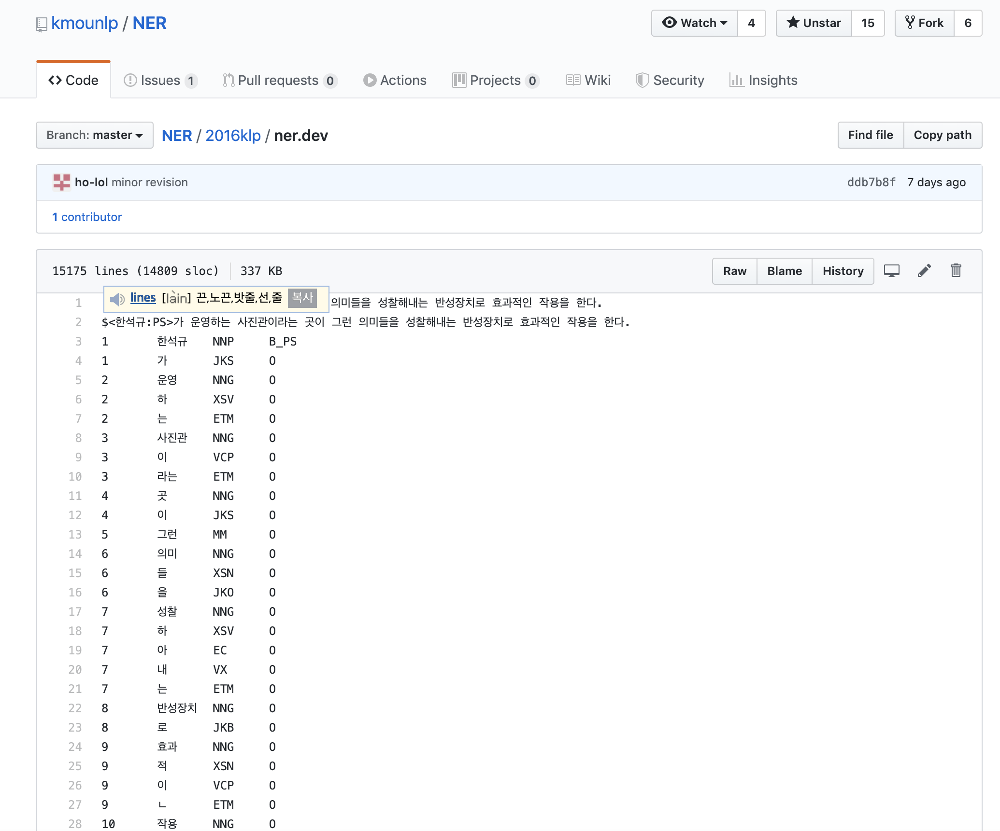
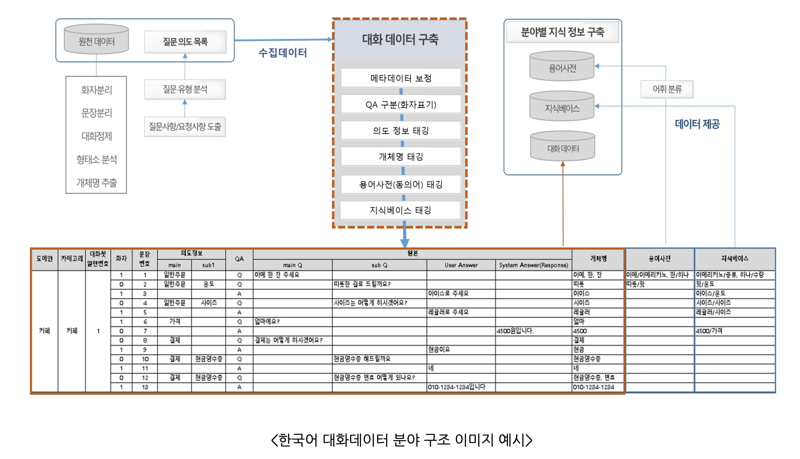
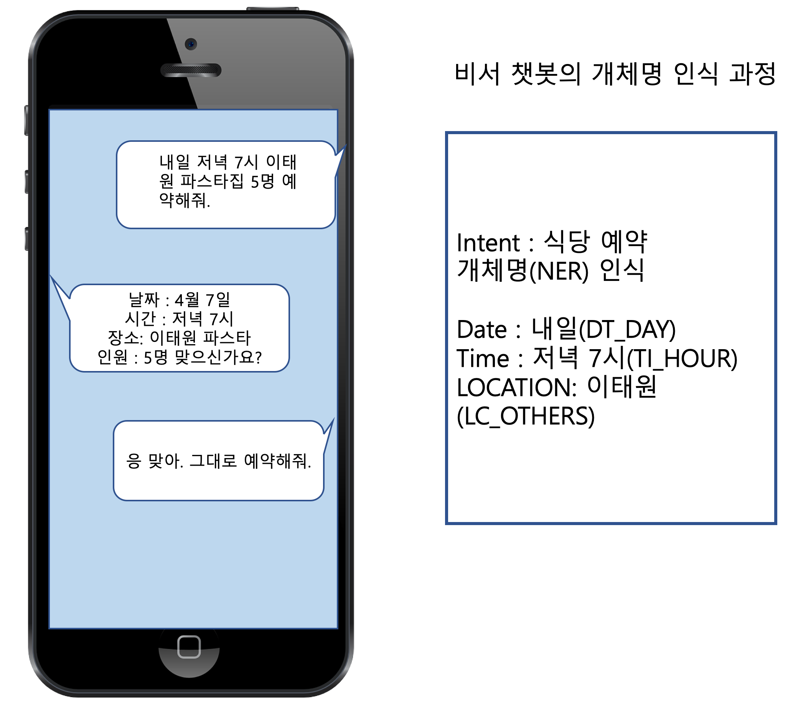

# Entity

-----------------------------------------------------------------------------------

## :octocat: 개체명 인식과 개체명 말뭉치 구축
개체명 인식(Named Entity Recognition, 이하 NER)은 자연어처리의 하위 분야로  문자열에서 미리 정의된 개체명 타입에 대해 개체명의 경계를 탐지하고 해당하는 타입으로 분류하는 작업을 의미한다. 주로 상호 참조(coreference resolution), 관계 추출(relation extraction), 사전 추출, 시간 표현 등에서 유용하게 사용된다.

한국어 개체명 데이터 구축을 위한 지침은 [TTA 표준](https://nanum.etri.re.kr/file/002.%EA%B0%9C%EC%B2%B4%EB%AA%85%EC%9D%B8%EC%8B%9D_%EA%B0%80%EC%9D%B4%EB%93%9C%EB%9D%BC%EC%9D%B8.pdf)이 일반적으로 사용되고 있으나 2020년과 2021년에 공개된 [모두의 말뭉치](https://corpus.korean.go.kr/)에서는 신문을 중심으로 하는 문어 외에도 웹 등에서 많이 사용되는 구어체 말뭉치 태깅을 위해 개체명의 타입 수가 늘어나 있는 것을 확인할 수 있다.  펭수와 같은 캐릭터, 강아지 이름 등을 태깅하기 위해 PS_CHARACTER, PS_PET  등이 추가된 것이 이러한 특징을 반영한다.              

 개체명 인식을 위한 말뭉치 구축이 어려운 이유는 새로운 개체명이 계속 만들어지고 있어서 완성된 사전을 가지기 어렵기 때문이다. 또한  같은 단어라도 사용되는 상황에 따라 다른 의미로 해석되는 중의성이 발생할 수 있다.                     

## :octocat: Open domain 또는 Closed domain
도메인을 구분하는 이유 역시 쉽게 중의성을 해소하기 위해서다.  가령, '여자 친구'의 '여름여름해'라는 곡이 있다면 사전적 의미로는 올바른 정보를 추출하기 어려울 수도 있다. 이를 대중가요라는 Closed domain에 가수와 곡명으로 분류하여 개체로 태깅해 주면 빠르게 정보에 접근할 수 있을 것이다.   

또한 병원 차트, 법원 녹취록 등은 특정한 목적을 위해 데이터를 별도로 구축하기 때문에 댜수의 전문 용어들이 특정한 의미로 쓰이게 된다. 아스피린과 같이 일반적으로 많이 쓰이는 용어도 있지만 대체로는 특정한 용어들을 개체로 태깅해 주는 것이 데이터 구축시 주요 작업일 것이다. 이 때 결과물은 개체명와 범주로 이루어진 사전 또는 태깅된 문서가 된다.   

### :octocat: 도메인 특정적이지 않은 개체명 데이터는 구축과 인식에 모두 품이 많이 든다. 하지만 잘 구축된 데이터는 주요한 정보를 잘 나타내 주어 큰 사용 가치를 지닌다.     

다음 링크의 영화평에서 개체명을 추출하여 구름 그림으로 시각화해 보면 간단한 시각화를 통해서도 정보 차이가 크다는 것을 직관적으로 알 수 있다.          

https://movie.naver.com/movie/bi/mi/reviewread.nhn?code=161967&nid=4704433

## :octocat: 역사
1. 1995년 MUC-6[the Sixth Message Understanding Conference]
(https://cs.nyu.edu/faculty/grishman/muc6.html) 에서 시작되었는데 당시 분류의 기준은 5 가지로  인명(PS), 기관명(OG), 장소(LC), 날짜(DT), 시간(TI) 분류 및 BIO(Begin, in, out) tag 를 붙이는 과제였다.     [NEtask20](https://cs.nyu.edu/faculty/grishman/NEtask20.book_7.html#HEADING18)에서 참조할 수 있다.      

                  

2. 이후 CoNLL(2002, 2003) shared task에서 Language-Independent Named Entity Recognition 과제가 이루어졌다.   

 ****`COUPUS`**** [CoNLL-2002 NER corpus](https://github.com/teropa/nlp/tree/master/resources/corpora/conll2002): 스페인어와 독일어 NER      

****`Quick peek`****

 
  ****`COUPUS`**** [CoNLL-2003 NER corpus](https://github.com/synalp/NER/tree/master/corpus/CoNLL-2003)   : 영어 NER 

  ****`COUPUS`**** [NUT Named Entity Recognition in Twitter Shared task](https://github.com/aritter/twitter_nlp/tree/master/data/annotated/wnut16)

  ****`TOOLKIT`**** [Stanford Named Entity Recognizer](https://nlp.stanford.edu/software/CRF-NER.shtml)

  ****`TOOLKIT`****
  영어의 경우 [nltk 패키지](https://towardsdatascience.com/named-entity-recognition-with-nltk-and-spacy-8c4a7d88e7da)를 통해 다음의 4단계를 거치면 입력 문장에서 사람, 조직, 장소 이름을 추출할 수 있다. 
* 문장분리 nltk.sent_tokenize
* 어절분리 nltk.word_tokenize
* 형태소 태깅 nltk.pos_tag
* 개체명 인식 nltk.chunk.ne_chunk

 https://paperswithcode.com/task/named-entity-recognition-ner

         

## :octocat: 영어 NER 시스템 성능 
영어를 위한 최신 NER 시스템은 인간에 근접한 성능을 낸다. 이를테면 MUC-7에 진입한 최고의 시스템은 F-measure 기준 93.39%을 받았으며 인간 주석자는 97.60%과 96.95%점을 받았다(https://ko.wikipedia.org/wiki/%EA%B0%9C%EC%B2%B4%EB%AA%85_%EC%9D%B8%EC%8B%9D)

- 5개 영역에 대한 개체명 분석이고 원시 코퍼스 distribution 역시 일정했을 것이다.
- 개체명의 범위를 더 다양하고 구어와 문어 등으로 도메인 정보가 달라지면 결과값은 달라질 수 있을 것이다.        
참고논문 [Adaptive Name Entity Recognition under Highly Unbalanced Data](https://arxiv.org/abs/2003.10296)

## :octocat: 국어 개체명 경진 대회

1. 국내에서는 2016년과 2017년 [국어정보처리 시스템 경진대회](https://ithub.korean.go.kr/user/contest/contestIntroView.do) 에서도 개체명 인식이 지정 분야였다. 

    
2. [Naver NLP Challenge](http://air.changwon.ac.kr/?page_id=10) 2018에서도 개채명 인식이 주요 과제중 하나였고 1위를 한 State_Of_The_Art팀은 F1 score가	90.4219로 성능 개선을 보였다.

3. 2021년 6월 한국어 이해를 위한 벤치마크 세트로 만들어진 KLUE 데이터는 KLUE-RoBERTa의 base 모델에서 Macro F1이 85.13이다. 

## :octocat: 공개된 국어 개체명 말뭉치 데이터  
   
1. HLCT 2016에서 제공한 데이터 세트 원본의 일부 오류를 수정하고 공개한 말뭉치                    

[KoreanNERCorpus](https://github.com/machinereading/KoreanNERCorpus)              

2. 한국어 개체명 정의 및 표지 표준화 기술보고서와 이를 기반으로 제작된 개체명 형태소 말뭉치

[mounlp_NER](https://github.com/mounlp/NER)

****`Quick peek`**** 
 

3. [aihub](http://aihub.or.kr/aidata/85)에서 사용자 의도가 반영된 개체(Entity)를 추출하여 시소러스 및 소상공인, 공공민원 분야를 위해 구축한 데이터 

****`Quick peek`**** 
 

 ##:octocat:  한국어 개체명 말뭉치의 방향
포멧이 사용하기 편하고 사용 예시가 분명한 단계로 진행되고 있다.
개체명 태그의 종류가 다양해지고 다양한 도메인에서도 유연하게 작용할 수 있는 방향을 모색해 가고 있다.

 ## :octocat: 주 응용 분야
 question answering, information retrieval, relation extraction

 

 ## :octocat: 참고 문헌   
 
1. Dan Jurafsky, [Speech and Language Processing (3rd ed. draft)](https://web.stanford.edu/~jurafsky/slp3/)           

2. [D. Nadeau and S. Sekine, “A survey of named entity recognition and classification,” Lingvist. Investig., vol. 30, no. 1, pp. 3–26, 2007.](https://nlp.cs.nyu.edu/sekine/papers/li07.pdf)      

3. Z. Zhang, X. Han, Z. Liu, X. Jiang, M. Sun, and Q. Liu, “ERNIE: enhanced language representation with informative entities,” in ACL, 2019, pp. 1441–1451.         

4. [Vikas Yadav, Steven Bethard, A Survey on Recent Advances in Named Entity Recognition from Deep Learning models, Submitted on 25 Oct 2019](https://arxiv.org/abs/1910.11470)   

###Github             
https://github.com/songys/nlp_tasks       

 
 ===================================================================
 
 # 이 [Github](https://github.com/songys/entity/tree/master/data)에서의 NER 데이터 구축 과정    

 1. 한글형태소 사전 NIADic에 사람과 장소 등의 정보를 참조했음      
https://kbig.kr/portal/kbig/knowledge/files/bigdata_report.page?bltnNo=10000000016451

2. 세종 2007과 공개 말뭉치를 파싱해서 2차 사전 구축              

3. 1과 2를 수작업으로 검수하여 최종 사전 구축         

DT 272개, LG 29799개, PS 11354개, TI 48개 

4. 관련논문                    
[박혜웅 송영숙(2017),음절 기반의 CNN를 이용한 개체명 인식, 한국정보과학회 발표 논문집](http://www.koreascience.or.kr/article/CFKO201712470015484.org)            

# 저작권 표기       

크리에이티브 커먼즈 저작자표시-  동일조건변경허락 2.0 국제 라이선스(CC BY-SA)​
(https://creativecommons.org/licenses/by-sa/3.0/deed.ko)

